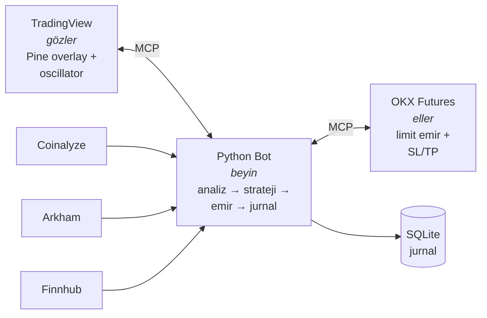
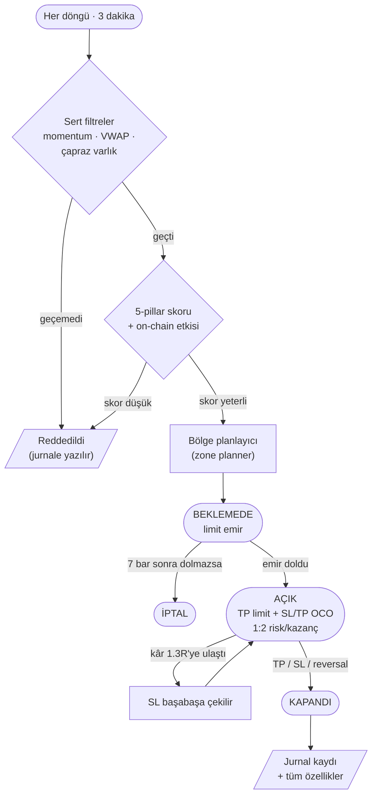
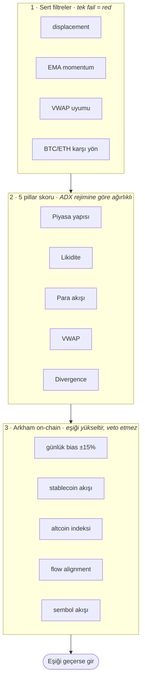

# SMTbot — AI-Powered Crypto Futures Trading Bot

OKX vadeli işlemlerinde otomatik çalışan bir scalper botu. TradingView'i
"gözleri", OKX'i "elleri", Python çekirdeğini "beyni" olarak kullanır.
Trade kararlarını bot verir — Claude Code sadece kodu yazar, parametreleri
ayarlar ve logları analiz eder.

> **TradingView = gözler · OKX = eller · Python = beyin**

---

## Kullanılan dış servisler

| Servis | Ne için | API key | Link |
|---|---|---|---|
| **OKX** | Vadeli işlem borsası (demo + live) | ✅ gerekli | [okx.com](https://www.okx.com) |
| **TradingView Desktop** | Grafik, Pine indikatörleri (MCP ile okunur) | abonelik | [tradingview.com](https://www.tradingview.com) |
| **Coinalyze** | Open Interest, funding, liquidation verisi | ✅ gerekli (free) | [coinalyze.net/api-access](https://coinalyze.net/api-access) |
| **Arkham** | On-chain CEX akışları, whale transferleri | ✅ gerekli (trial) | [arkhamintelligence.com](https://www.arkhamintelligence.com) |
| **Finnhub** | Makro ekonomik takvim (FOMC, CPI vb. blackout) | ✅ gerekli (free) | [finnhub.io](https://finnhub.io/dashboard) |
| **FairEconomy** | Makro takvim (yedek, key gerekmez) | ❌ | [faireconomy.media](https://www.faireconomy.media) |
| **Binance Public** | Fiyat cross-check (public API) | ❌ | [binance.com](https://www.binance.com) |

Ücretsiz tier'lar proje ihtiyacına yetiyor. Arkham 30 günlük trial ile başlar;
credit limiti %95'e ulaşırsa bot otomatik devre dışı bırakır.

---

## İş akışı

### Sistem mimarisi



### Tek bir trade'in hayatı



### Skorlama katmanları



---

## Kurulum

### 1. Önkoşullar

- Python 3.11+
- Node.js 18+ (MCP server'ları için)
- TradingView Desktop (abonelik)
- OKX hesabı (demo yeterli)

### 2. Repo'yu klonla ve venv oluştur

```bash
git clone https://github.com/last-26/SMTbot.git
cd SMTbot

python -m venv .venv
.venv/Scripts/activate        # Windows
# source .venv/bin/activate    # macOS / Linux

pip install -r requirements.txt
```

### 3. API key'leri al ve .env dosyasını doldur

```bash
cp .env.example .env
```

`.env` içine doldurman gerekenler:

```env
OKX_API_KEY=...
OKX_API_SECRET=...
OKX_PASSPHRASE=...
OKX_DEMO_FLAG=1            # 1 = demo, 0 = live

COINALYZE_API_KEY=...
FINNHUB_API_KEY=...
ARKHAM_API_KEY=...         # opsiyonel, on_chain devre dışıysa gerekmez
```

**OKX demo hesabı ayarları** (bu üçünü yapmazsan hiçbir emir yerleşmez):
1. Demo Trading → Settings → **Account mode = Futures**
2. **Position mode = Hedge (Long/Short)**
3. API key'e **Read + Trade** yetkisi ver (Withdrawal **asla** verme)

### 4. MCP server'ları kur

```bash
# OKX ticaret MCP
npm install -g okx-trade-mcp okx-trade-cli
okx setup --client claude-code --profile demo --modules all

# TradingView Desktop'u debug portuyla başlat
"C:\TradingView\TradingView.exe" --remote-debugging-port=9222
```

### 5. Çalıştır

```bash
# Sadece bir döngü, gerçek emir açmaz (smoke test)
.venv/Scripts/python.exe -m src.bot --config config/default.yaml --dry-run --once

# Demo üzerinde sürekli çalıştır
.venv/Scripts/python.exe -m src.bot --config config/default.yaml

# Live — sadece demo'yu doğruladıktan sonra
OKX_DEMO_FLAG=0 .venv/Scripts/python.exe -m src.bot --config config/default.yaml
```

---

## Güvenlik

- **Her zaman demo ile başla.** Live'a geçmeden önce en az birkaç gün demo'da izle.
- API key'ine **asla** withdrawal yetkisi verme. Key'i makine IP'sine bağla.
- Live'da sub-account kullan, ana hesabı bot'a bağlama.
- Circuit breaker'lar (drawdown, ardışık kayıp, günlük limit) `src/strategy/risk_manager.py` içinde.
- Bu bir araştırma projesidir, finansal tavsiye değildir. Kripto vadeli işlem
  = tasfiye riski.

---

## Daha fazla

Teknik detaylar, tüm parametreler, geliştirme yol haritası ve operasyonel
playbook için → [CLAUDE.md](CLAUDE.md)

## Lisans

[LICENSE](LICENSE)
