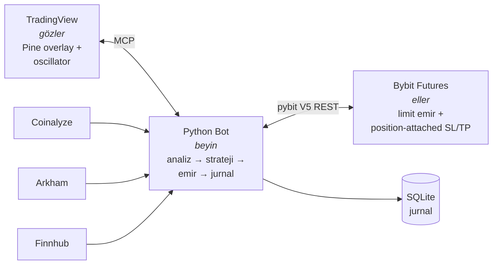
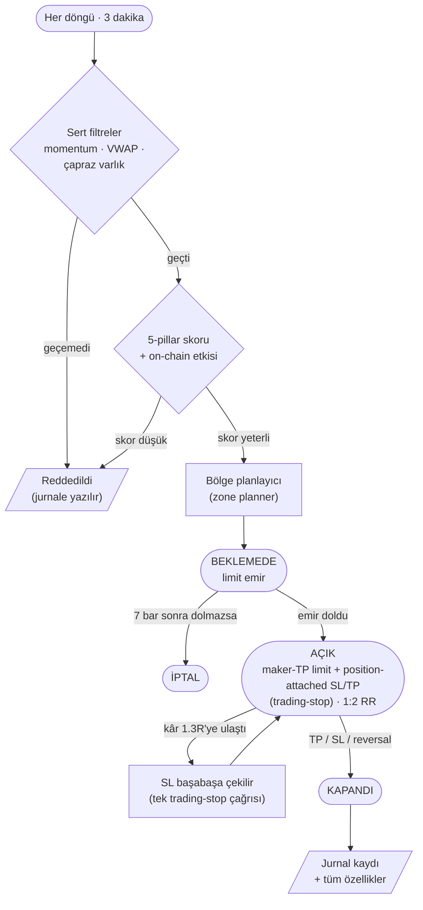

# SMTbot — AI-Powered Crypto Futures Trading Bot

Bybit V5 vadeli işlemlerinde otomatik çalışan bir scalper botu. TradingView'i
"gözleri", Bybit'i "elleri", Python çekirdeğini "beyni" olarak kullanır.
Trade kararlarını bot verir — Claude Code sadece kodu yazar, parametreleri
ayarlar ve logları analiz eder.

> **TradingView = gözler · Bybit = eller · Python = beyin**

---

## Kullanılan dış servisler

| Servis | Ne için | API key | Link |
|---|---|---|---|
| **Bybit** | USDT vadeli (UTA, hedge mode, demo + live) | ✅ gerekli | [bybit.com](https://www.bybit.com) |
| **TradingView Desktop** | Grafik, Pine indikatörleri (MCP ile okunur) | abonelik | [tradingview.com](https://www.tradingview.com) |
| **Coinalyze** | Open Interest, funding, liquidation verisi | ✅ gerekli (free) | [coinalyze.net/api-access](https://coinalyze.net/api-access) |
| **Arkham** | On-chain CEX akışları, whale transferleri | ✅ gerekli ($6250) | [arkhamintelligence.com](https://www.arkhamintelligence.com) |
| **Finnhub** | Makro ekonomik takvim (FOMC, CPI vb. blackout) | ✅ gerekli (free) | [finnhub.io](https://finnhub.io/dashboard) |
| **FairEconomy** | Makro takvim (yedek, key gerekmez) | ❌ | [faireconomy.media](https://www.faireconomy.media) |
| **Binance Public** | Fiyat cross-check (public API) | ❌ | [binance.com](https://www.binance.com) |

Ücretsiz tier'lar proje ihtiyacına yetiyor. Arkham 30 günlük trial ile başlar;
credit limiti %95'e ulaşırsa bot otomatik devre dışı bırakır.

---

## İş akışı

### Sistem mimarisi



### Tek bir trade'in hayatı



### Skorlama katmanları


---

## Kurulum

### 1. Önkoşullar

- Python 3.11+
- Node.js 18+ (TradingView MCP için)
- TradingView Desktop (abonelik)
- Bybit Demo Trading hesabı

### 2. Repo'yu klonla ve venv oluştur

```bash
git clone https://github.com/last-26/SMTbot.git
cd SMTbot

python -m venv .venv
.venv/Scripts/activate        # Windows
# source .venv/bin/activate    # macOS / Linux

pip install -r requirements.txt
```

### 3. Bybit Demo hesap ayarları

Bot tek bir emir bile yerleştirmeden önce şunları yap:

1. Bybit mainnet'e giriş yap → sol üstten **Demo Trading** moduna geç
2. Demo Trading paneli içinden ayrı bir API key üret (mainnet key'i ile aynı değil)
3. **Account type: UNIFIED (UTA)** — varsayılan, cross margin açık
4. **Position mode: Hedge** — bot ilk açılışta `POST /v5/position/switch-mode mode=3` ile otomatik ayarlar (idempotent)
5. **Collateral toggles:** USDT + USDC = ON, BTC / ETH (varsa) = OFF. Bot `totalMarginBalance`'ı pozisyon büyüklüğü için kullanır; non-trading varlıklar pool'a girerse over-allocate olur
6. API key yetkisi: **Read + Trade** (Withdrawal **asla**). IP whitelist önerilir (yoksa 90 gün, varsa süresiz)

### 4. Konfigürasyonu hazırla

`config/default.example.yaml` jenerik scalper başlangıç ayarlarını içerir
(public starter). Kendi tune edilmiş kopyanı oluşturmak için kopyala:

```bash
cp config/default.example.yaml config/default.yaml
```

Sonra `config/default.yaml` üzerinden dataset'ine göre tune et — orijinal
kopya gitignored olduğu için kişisel ayarların commit'lenmez.

### 5. .env dosyasını doldur

```bash
cp .env.example .env
```

`.env` içine doldurman gerekenler:

```env
BYBIT_API_KEY=...
BYBIT_API_SECRET=...
BYBIT_DEMO=1               # 1 = demo, 0 = live

COINALYZE_API_KEY=...
FINNHUB_API_KEY=...
ARKHAM_API_KEY=...         # opsiyonel, on_chain devre dışıysa gerekmez
```

### 6. TradingView MCP'i başlat

```bash
"C:\TradingView\TradingView.exe" --remote-debugging-port=9222
```

(Bybit için ayrı MCP yok — bot doğrudan `pybit` SDK ile V5 REST'e konuşur.)

### 7. Bağlantı testini çalıştır

```bash
.venv/Scripts/python.exe scripts/test_bybit_connection.py
```

Bu cüzdan bakiyesini, instrument spec'lerini, mark fiyatlarını, açık pozisyonları ve resting order'ları okur — hiç emir vermez. Demo bağlantısının sağlıklı olduğunu teyit eder.

### 8. Botu çalıştır

```bash
# Sadece bir döngü, gerçek emir açmaz (smoke test)
.venv/Scripts/python.exe -m src.bot --config config/default.yaml --dry-run --once

# Demo üzerinde sürekli çalıştır
.venv/Scripts/python.exe -m src.bot --config config/default.yaml

# Live — sadece demo'yu doğruladıktan sonra
# BYBIT_DEMO=0 .env'de + BybitClient(allow_live=True) zorunlu;
# constructor varsayılan olarak live'ı reddeder.
```

### TR ISP egress notu

Bazı Türk ISP'leri (mobil + fiber) `api-demo.bybit.com`'un cevap verdiği bazı CloudFront edge IP aralıklarına (`13.249.8.0/24` gözlemlendi) TCP-443 SYN paketlerini sessizce düşürüyor. Bot her açılışta DNS'i probe edip ulaşılabilir bir edge'i pinler (`bybit_demo_dns_pinned host=… ip=…` log satırı). Eğer `bybit_demo_dns_pin_failed` görürsen:

- Sistem DNS'ini `8.8.8.8` / `1.1.1.1` yap
- GoodbyeDPI gibi DPI atlatma araçları varsa kapat (TLS fragmanları demo CloudFront tarafından reset alıyor)
- Tekrar bağlantı testini çalıştır

---

## Güvenlik

- **Her zaman demo ile başla.** Live'a geçmeden önce en az birkaç gün demo'da izle.
- API key'ine **asla** withdrawal yetkisi verme. Key'i makine IP'sine bağla (whitelist).
- Live'da sub-account kullan, ana hesabı bot'a bağlama.
- `BybitClient` constructor'ı varsayılan olarak live'ı reddeder; live'a geçmek için hem `BYBIT_DEMO=0` hem `allow_live=True` zorunlu.
- Circuit breaker'lar (drawdown, ardışık kayıp, günlük limit) `src/strategy/risk_manager.py` içinde.
- Bu bir araştırma projesidir, finansal tavsiye değildir. Kripto vadeli işlem
  = tasfiye riski.

---

## Lisans

[LICENSE](LICENSE)
